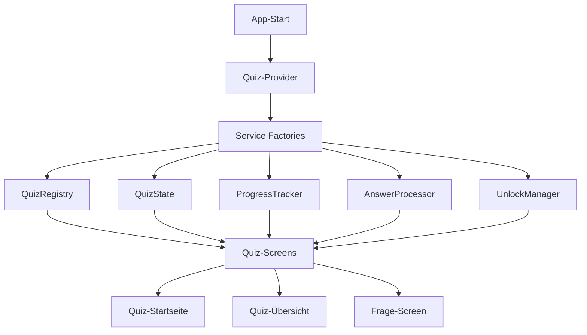
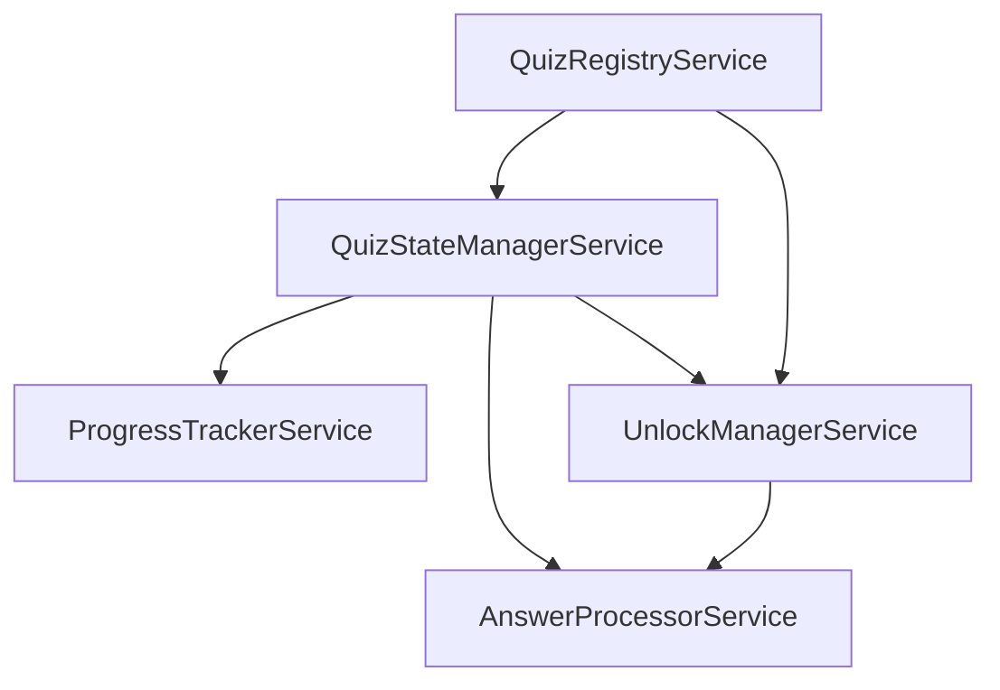
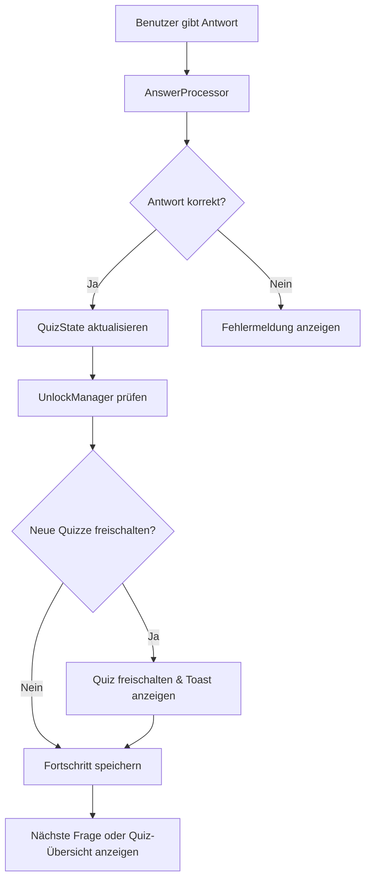
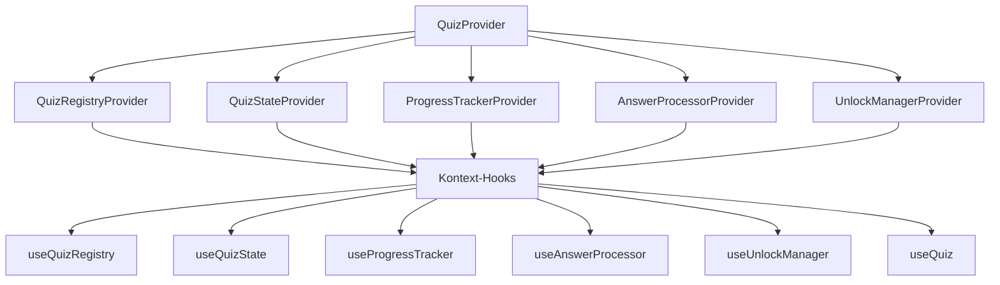

# Erkennst du das Tier? - Projektübersicht und Refactoring

## Projektübersicht

"Erkennst du das Tier?" ist eine mobile Quiz-Anwendung, entwickelt mit React Native und Expo. Benutzer sehen Bilder von Tieren und müssen deren Namen erraten, entweder durch Eingabe eines Textes oder durch Auswahl aus vorgegebenen Optionen (Multiple-Choice).

### Kerneigenschaften:

- **Verschiedene Quiz-Kategorien**: Emojis, Namibia-Tiere, und "Weird Animals"
- **Unterschiedliche Fragetypen**: Texteingabe und Multiple-Choice
- **Freischaltbares Gameplay**: Neue Quiz-Kategorien werden freigeschaltet, wenn bestimmte Bedingungen erfüllt sind
- **Fortschrittsverfolgung**: Das Spiel verfolgt den Fortschritt des Spielers in jedem Quiz

### Architektur:

Die Anwendung basiert auf einer klaren Trennung von:
1. **Core Layer**: Generische Quiz-Funktionalität
2. **Content Layer**: Tierspezifische Daten und Logik
3. **Presentation Layer**: UI-Komponenten und Screens

## Flow-Diagramme

### Architektur-Übersicht



### Service-Dependency-Flow



### Daten-Flow beim Beantworten einer Frage



### Provider-Struktur und Kontext-Zugriff



## Aktueller Stand des Refactorings

### Abgeschlossene Verbesserungen:

1. **Service-Factories implementiert**:
   - Jeder Service wird nun durch eine Factory-Funktion erstellt
   - Services erhalten explizit ihre Abhängigkeiten
   - Reduzierung globaler Zustandsvariablen

2. **Provider-Struktur optimiert**:
   - Provider haben Zugriff auf Service-Instanzen
   - Klare Trennung von Service-Logik und Kontext-Verwaltung

### Nutzen der Verbesserungen:

1. **Bessere Testbarkeit**:
   - Services können mit Mock-Abhängigkeiten getestet werden
   - Isolation von Komponenten für Unit-Tests

2. **Erhöhte Wartbarkeit**:
   - Explizite Abhängigkeiten statt impliziter globaler Zustände
   - Besseres Verständnis der Serviceinteraktionen
   - Klare API-Grenzen zwischen Diensten

3. **Erweiterbarkeit**:
   - Neue Services können einfach hinzugefügt werden
   - Bestehende Services können leichter ausgetauscht werden

### Nächste Schritte:

1. **Persistenzstrategie implementieren**:
   - Integration von AsyncStorage für Speicherung von Fortschritt und Einstellungen
   - Trennung zwischen flüchtigem und persistentem Zustand

2. **Error-Handling verbessern**:
   - Strukturierte Fehlerbehandlung statt einfacher Fehlermeldungen
   - Implementierung von Error Boundaries

3. **State Management optimieren**:
   - Reevaluierung der eigenen State-Management-Lösung
   - Eventuell Integration von Zustand oder Redux/Toolkit für komplexere Szenarien

4. **Typensicherheit erhöhen**:
   - Vermeidung von `any` wo immer möglich
   - Nutzung von strikteren TypeScript-Einstellungen

## Code-Struktur

Die Hauptkomponenten der Anwendung sind:

- `src/core/`: Core-Funktionalität, die unabhängig vom konkreten Quiz-Inhalt ist
- `src/quiz/`: Quiz-spezifische Logik und UI-Komponenten
- `src/animals/`: Tier-spezifische Inhalte und Adapter
- `src/common/`: Gemeinsam genutzte UI-Komponenten und Utilities

Jeder Service folgt jetzt dem Factory-Pattern:

```typescript
// Service-Interface
interface ServiceInterface {
  // Methoden des Services
}

// Factory-Funktion
export const createService = (
  dependency1: Dependency1Type,
  dependency2: Dependency2Type
): ServiceInterface => {
  // Private Zustände
  let privateState = ...;
  
  // Service-Instanz zurückgeben
  return {
    method1: () => { ... },
    method2: () => { ... }
  };
};
```

Provider greifen auf diese Services zu und stellen sie für die Anwendung bereit:

```typescript
export function ServiceProvider({ children }) {
  // Service-Instanz abrufen
  const service = getService();
  
  const contextValue = {
    service,
    // Re-exported service methods
    method1: service.method1,
    method2: service.method2
  };
  
  return (
    <ServiceContext.Provider value={contextValue}>
      {children}
    </ServiceContext.Provider>
  );
}
```

## Zusammenfassung

Das Projekt "Erkennst du das Tier?" hat durch die Implementierung von Service-Factories und die Optimierung der Provider-Struktur einen bedeutenden Schritt in Richtung besserer Wartbarkeit und Testbarkeit gemacht. Die klare Trennung von Verantwortlichkeiten und die explizite Dependency Injection verbessern die Codequalität und erleichtern zukünftige Erweiterungen.

Das Refactoring folgt den Best Practices für React Native-Anwendungen und nutzt TypeScript, um eine robuste und typsichere Codebasis zu gewährleisten.
