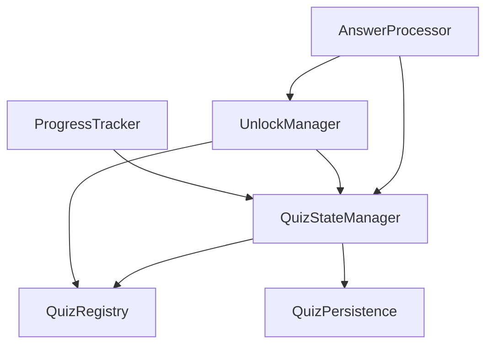

# Services

## Überblick

Services implementieren die Geschäftslogik der Quiz-Anwendung und stellen APIs für UI-Komponenten bereit. Alle Services verwenden das Factory Pattern mit expliziter Dependency Injection.

## Zweck

- **Business Logic**: Kapselung der Geschäftslogik in testbare Services
- **Dependency Injection**: Explizite Dependencies für bessere Testbarkeit
- **State Management**: Verwaltung von Application State
- **API Abstraction**: Einheitliche APIs für UI Layer

## Struktur

```bash
services/
├── factories/          # Service-Factory-Implementierungen
├── answerProcessor.ts  # Re-exports für AnswerProcessor
├── progressTracker.ts  # Re-exports für ProgressTracker
├── quizRegistry.ts     # Re-exports für QuizRegistry
├── quizStateManager.ts # Re-exports für QuizStateManager
├── unlockManager.ts    # Re-exports für UnlockManager
└── index.ts           # Zentrale Exports
```

## Service-Architekturen

### Factory Pattern

```typescript
// Service-Interface definieren
interface MyService {
  doSomething(): void;
}

// Factory-Funktion mit Dependencies
export const createMyService = (
  dependency1: Dep1,
  dependency2: Dep2
): MyService => {
  // Private state
  let privateData = {};
  
  // Service-Implementierung
  return {
    doSomething: () => { /* Logik */ }
  };
};

// Singleton-Export
const myService = createMyService(dep1, dep2);
export const getMyService = () => myService;
```

## Core Services

### QuizRegistryService

**Zweck**: Verwaltung aller verfügbaren Quizzes

```typescript
interface QuizRegistryService {
  registerQuiz<T>(id, quiz, contentType?) → void
  getQuizById<T>(id) → Quiz<T> | undefined
  getAllQuizzes<T>() → Quiz<T>[]
  getQuizzesByContentType<T>(type) → Quiz<T>[]
  updateQuiz<T>(id, quiz, contentType?) → void
}
```

**Features**:

- Typisierte Quiz-Verwaltung
- Content-Type-basierte Filterung
- Update-Funktionalität für Quiz-Änderungen

### QuizStateManagerService

**Zweck**: Zustandsverwaltung für aktive Quizzes + Persistierung

```typescript
interface QuizStateManagerService {
  initializeQuizState<T>(quizId) → Promise<QuizState<T> | null>
  getQuizState<T>(quizId) → QuizState<T> | undefined
  updateQuizState<T>(quizId, newState) → Promise<void>
  resetQuizState<T>(quizId) → Promise<QuizState<T> | null>
  getAllQuizStates() → Map<string, QuizState>
}
```

**Features**:

- Asynchrone Persistierung mit QuizPersistenceService
- Lazy Loading von gespeicherten Zuständen
- Automatische Zustandssynchronisierung

### AnswerProcessorService

**Zweck**: Verarbeitung von Benutzerantworten

```typescript
interface AnswerProcessorService {
  answerQuizQuestion<T>(quizId, questionId, answer) → Promise<{
    isCorrect: boolean;
    newState?: QuizState<T>;
    nextQuestionId?: number;
    unlockedQuiz?: Quiz;
  }>
}
```

**Pipeline**:

1. Quiz/Frage validieren
2. Antwort normalisieren
3. Domain Logic anwenden
4. State aktualisieren & persistieren
5. Freischaltungen prüfen

### ProgressTrackerService

**Zweck**: Fortschrittsverfolgung und -berechnung

```typescript
interface ProgressTrackerService {
  getQuizProgress(quizId) → number           // Prozent
  getQuizProgressString(quizId) → string     // "X von Y gelöst"
  isQuizCompleted(quizId) → boolean
  getNextActiveQuestion(quizId, current?) → number | null
}
```

### UnlockManagerService

**Zweck**: Freischaltungslogik und Event-System

```typescript
interface UnlockManagerService {
  getUnlockProgress(quizId) → { condition, progress, isMet }
  unlockNextQuiz() → Quiz | null
  checkForUnlocks() → Quiz[]
  checkAllUnlockConditions() → { unlockedQuizzes, availableUnlocks }
  addUnlockListener(listener) → void
  removeUnlockListener(listener) → void
}
```

**Features**:

- Event-System für Freischaltungs-Benachrichtigungen
- Automatische Freischaltung nach Quiz-Abschluss
- Fortschritts-Tracking für Freischaltbedingungen

## Service Dependencies



## Re-Export Pattern

Jeder Service hat eine Re-Export-Datei für einfacheren Zugriff:

```typescript
// quizRegistry.ts
const quizRegistryService = createQuizRegistryService();

export const registerQuiz = (...args) => 
  quizRegistryService.registerQuiz(...args);

export const getQuizById = (...args) => 
  quizRegistryService.getQuizById(...args);

export const getQuizRegistryService = () => quizRegistryService;
```

## Error Handling

Services implementieren strukturierte Fehlerbehandlung:

```typescript
const service = {
  async someOperation(id) {
    try {
      console.log(`[ServiceName] Starting operation for ${id}`);
      const result = await doSomething(id);
      console.log(`[ServiceName] Operation completed for ${id}`);
      return result;
    } catch (error) {
      console.error(`[ServiceName] Error in operation for ${id}:`, error);
      throw error;
    }
  }
};
```

## Verwendung in UI

Services werden über Context Provider bereitgestellt:

```typescript
// In Component
const { answerQuizQuestion } = useAnswerProcessor();

const handleSubmit = async () => {
  const result = await answerQuizQuestion(quizId, questionId, answer);
  // Handle result...
};
```

## Testing Strategy

Factory Pattern ermöglicht einfaches Mocking:

```typescript
describe('AnswerProcessorService', () => {
  it('processes correct answer', async () => {
    const mockStateManager = {
      getQuizState: jest.fn().mockReturnValue(mockState),
      updateQuizState: jest.fn()
    };
    
    const service = createAnswerProcessorService(
      mockStateManager,
      mockUnlockManager
    );
    
    const result = await service.answerQuizQuestion('quiz1', 1, 'answer');
    expect(result.isCorrect).toBe(true);
  });
});
```

## Performance

- **Lazy Initialization**: Services werden bei Bedarf erstellt
- **Singleton Pattern**: Eine Instanz pro Service
- **Memoization**: Berechnete Werte werden gecacht
- **Async Operations**: Keine Blocking-Operationen
